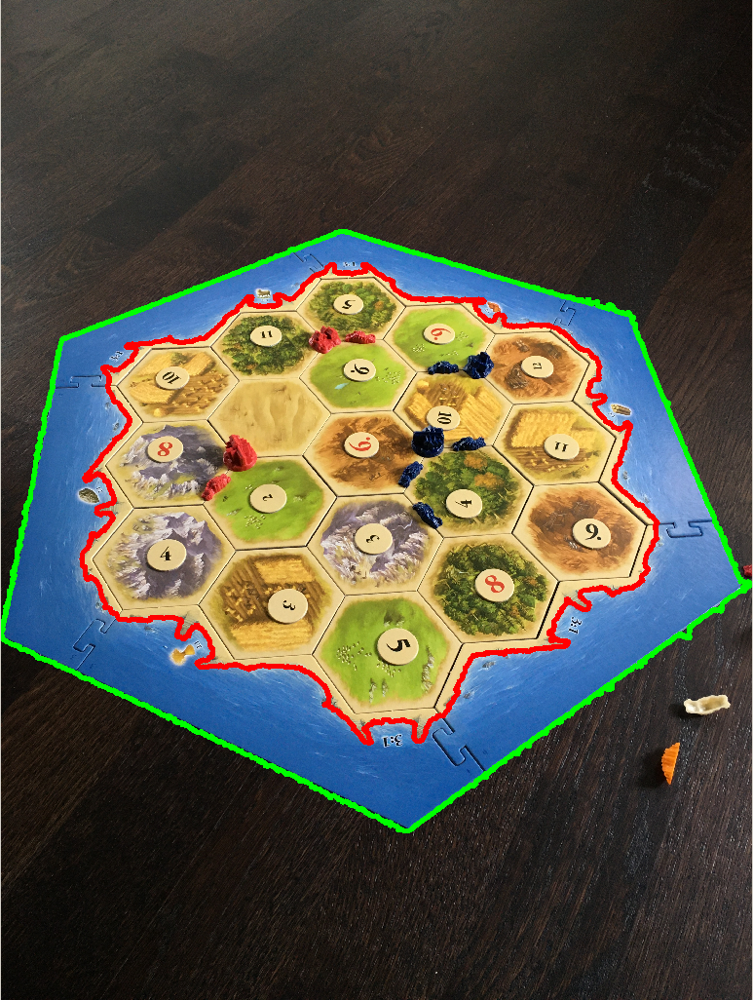
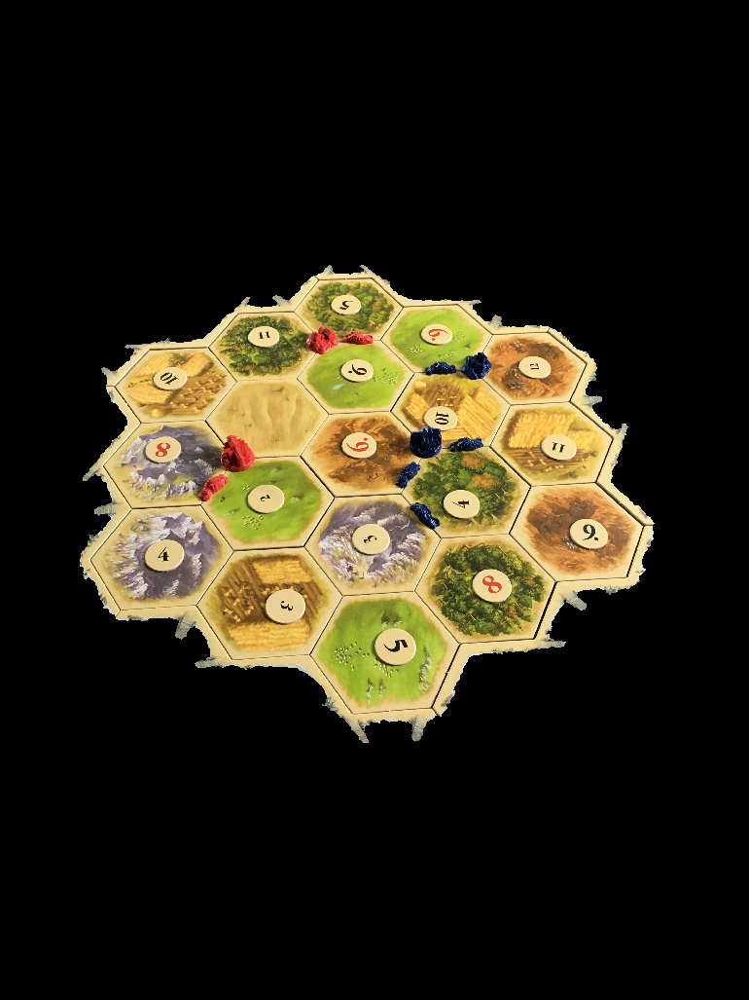
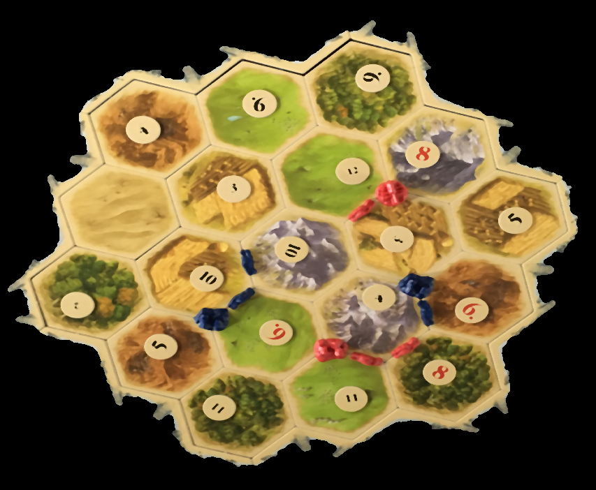
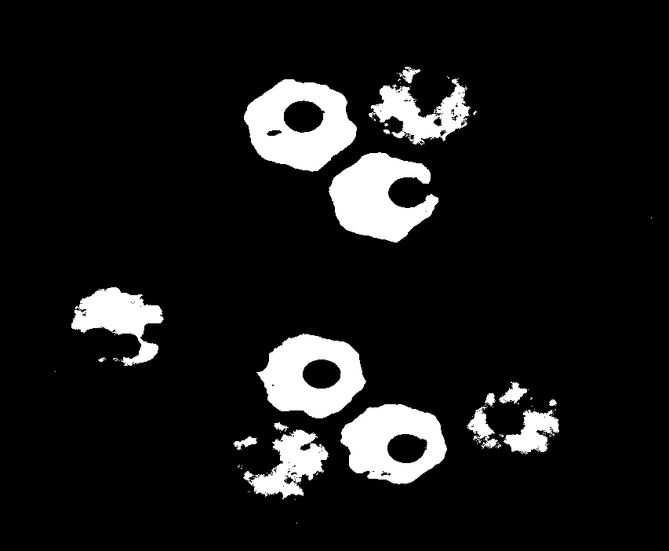
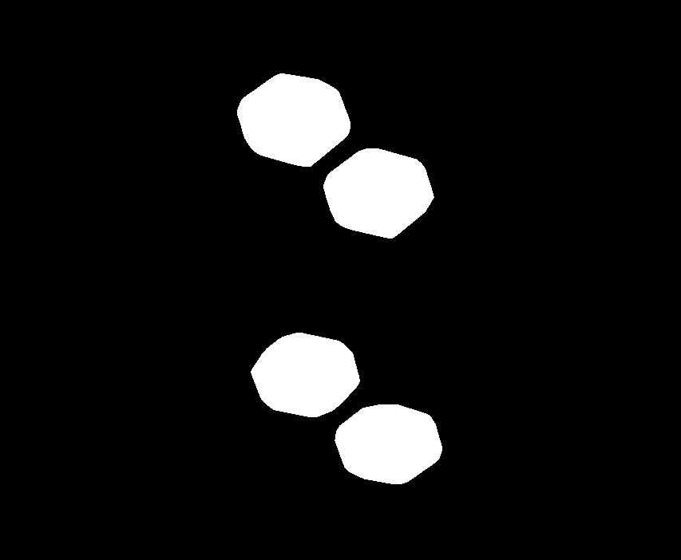
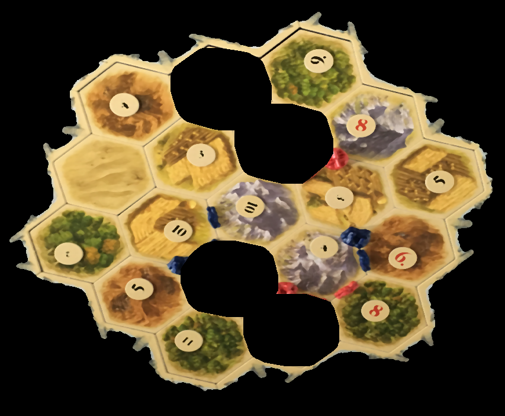
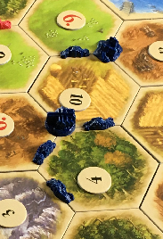
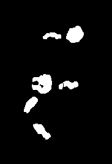

# Catan-Image-Recognition

#### *Python, OpenCV*

Based on a picture of the game board, the algorithm recognizes the state of the game the Settlers of Catan,
i.e. the arrangement of hexagonal fields representing the resources and the placement of players' pieces (red, blue and orange players).

In the first step it tries to isolate the board itself from the photo in order to omit irrelevant elements on the background. 
Then, each field type is sequentially located, starting with the most outstanding. The fields are found based on a selection of pixels belonging to
to the preset range of HSV values. In order to facilitate the search for next fields, previously found ones
are removed from the processed photo. As some fields are similar in color, at some point it is necessary to scale the saturation of the image, 
additionally a median filter was also used.

The players' pawns are found similarly. Cities and settlements are distinguished from roads by their shape similar to a circle 
(cities have a round base, while settlements, despite their irregular shape, approximate a circle quite well).

Some images presenting the process:

